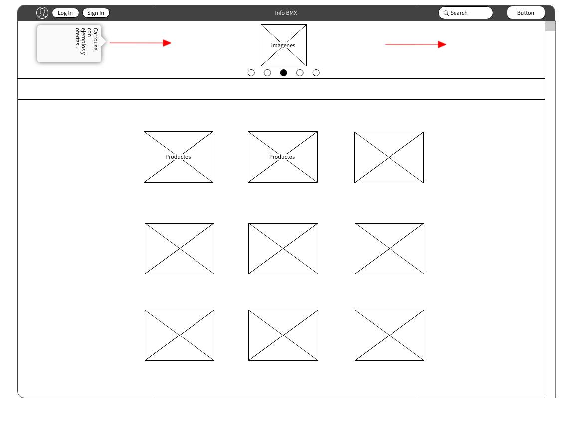
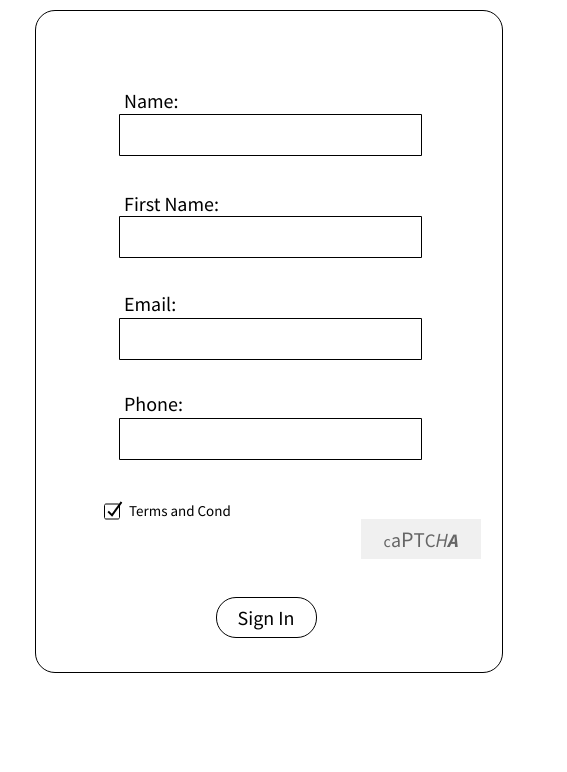
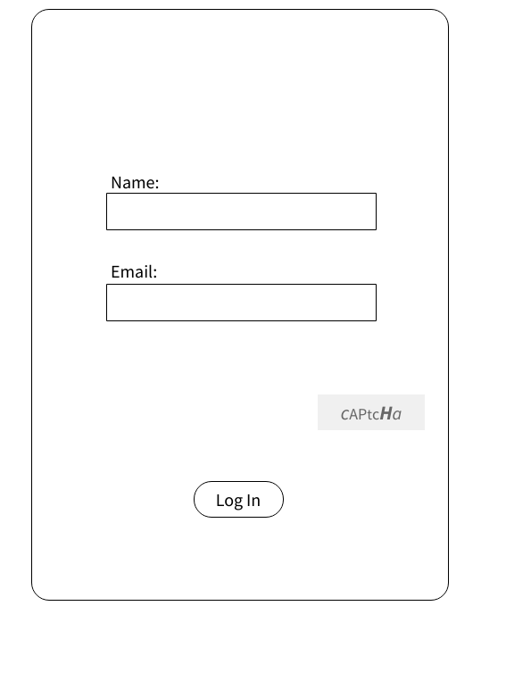
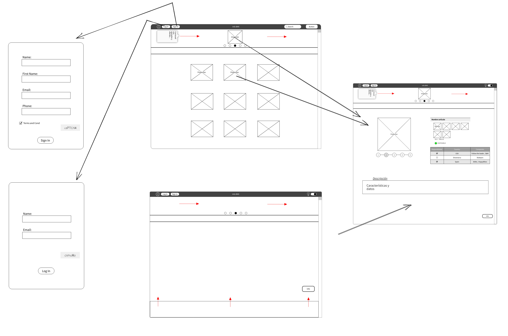
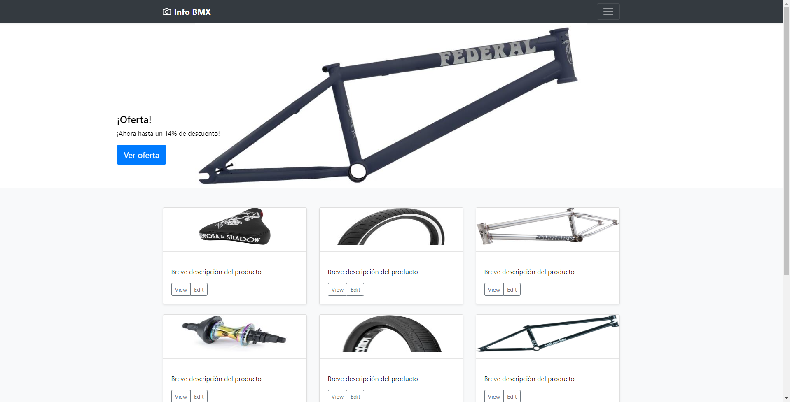

# Proyecto-final

Nombre del proyecto : **_Info BMX_**

## Explicación previa

Querría crear una página web para facilitar las busquedas de piezas de BMX, utilizando tanto HTML como CSS y JS. ¡Me gustaría implementar todo lo que he aprendido y más!

## Lluvia de ideas

- Idea 1:
  Enciclopedia
  / Descartada porque no me gustaba.

- Idea 2:
  Cartelera
  / Descartada porque no me convencía.

- Idea 3:
  Biblioteca
  / Me gustó la idea de tener un lugar donde buscar y encontrar lo que se necesite, pero no me terminaba de gustar la idea.

- Idea 4:
  Web de valoraciones
  / Descartada ya que no le veía utilidad.

- Idea 5:
  Encuestas
  / Descartada porque tampoco le veía utilidad.

- Idea 6:
  Tienda de compras
  / Me gustó la idea, pero no tenía muy claro de que quería hacer la tienda.

- Idea 7:
  Página de ventas de vinos
  / Me gustó la idea pero no lo que quería vender.

- Idea 8:
  Página de ventas de piezas de bicis
  / Me gustó la idea, ya que domino un poco más de lo normal el mundo del ciclismo.

- Idea 9:
  Página de busqueda de piezas de bicis de BMX y compra de las mismas.
  / Pensé en buscarle una utilidad a mi página web, ya que una tienda como tal no me terminaba de convencer.

- Idea 10: (FINAL)
  Buscador de piezas
  / Me terminé decantando por una página donde sea de mucha utilidad, reagrupando todos los productos posibles y así facilitar la busqueda a los clientes.

# Nombre del proyecto:

**_Info BMX_**

## Descripcion del proyecto:

Este proyecto será un FrontEnd dónde se pueda buscar piezas en concreto y su disponibilidad, así los usuarios tendrán más facilidad a la hora de encontrar piezas más concretas y en que lugar encontrarlas.

## Descripcion de las carcteristicas

Es una web que permite a todos los usuarios que quieran el poder encontrar piezas en concreto y su disponibilidad, incluyendo especificaciones, detalles, tallas, medidas, etc. Tiene como base poder hacer más fácil la busqueda de productos específicos.

### Usuarios potenciales (Mercado)

Toda la gente que practique BMX o que esté interesada en comprar algun producto del mismo, ya sea para uso particular, comercial o profesional, e incluso para tiendas que quieran o necesiten algunas piezas. Desde los más pequeños hasta los más mayores.

# Documentacion técnica

## Base

Se crearan 5 html estáticas y estos tendran **cargas dinámicas de otros ficheros** para importar fragmentos como el menu y otras partes de la página...
Se utilizará CSS y o Boostrap para partes del diseño de la misma, incluso para una mejora en la usabilidad de la página.
También se utilizará JS para conseguir un diseño algo más vistoso y así conseguir un diseño más sencillo de comprender.

`También me gustaría añadir algo de BackEnd.`

### Herramientas

Utilizaré GitHub para llevar el control de versiones, se utilizará la web "http://phpmyadmin.net" para tener una DB local en internet 24/7, también se utilizará Freenom para establecer un dominio fijo para la página.
Se utilizará composer para mantener las librerias actualizadas.

#### Lenguajes

HTML
CSS
JS
PHP
MySQL

## Diagrama de grantt

| Días/Lang | HTML   | CSS    | JS     | PHP    | MySQL  |
| --------- | ------ | ------ | ------ | ------ | ------ |
| Día 1     | **Sí** | **Sí** | No     | No     | No     |
| Día 2     | **Sí** | **Sí** | No     | No     | No     |
| Día 3     | **Sí** | **Sí** | No     | No     | No     |
| Día 4     | **Sí** | **Sí** | No     | No     | No     |
| Día 5     | **Sí** | **Sí** | No     | No     | No     |
| Día 6     | **Sí** | **Sí** | No     | No     | No     |
| Día 7     | **Sí** | **Sí** | No     | No     | No     |
| Día 8     | No     | No     | **Sí** | No     | No     |
| Día 9     | No     | No     | **Sí** | No     | No     |
| Día 10    | No     | No     | **Sí** | No     | No     |
| Día 11    | **Sí** | No     | **Sí** | No     | No     |
| Día 12    | No     | No     | No     | **Sí** | **Sí** |
| Día 13    | No     | No     | No     | **Sí** | **Sí** |
| Día 14    | No     | No     | No     | **Sí** | **Sí** |
| Día 15    | **Sí** | **Sí** | **Sí** | No     | No     |
| Día 16    | **Sí** | **Sí** | **Sí** | **Sí** | **Sí** |
| Día 17    | **Sí** | **Sí** | **Sí** | **Sí** | **Sí** |
| Día 18    | **Sí** | **Sí** | **Sí** | **Sí** | **Sí** |

## Wireframes

-Index

-Menu

-Producto seleccionado

-Sign In

-Log In

## Paths

## Mokups

## Casos de uso

-Registra nuevos usuarios y vincula sus datos, de esta forma se puede mantener al día a todos los usuarios de ofertas o nuevos productos.

### Explicación de los casos de uso

- ### Caso de uso "Registra entrada"

  1.Utilizando el botón de `Sign In` se redirecciona a una página a parte con un formulario para rellenar los datos y así guardarlos en una base de datos. De esta forma se pueden aplicar algunos de los datos introducidos para facilitar las busquedas.

  2.Utilizando el botón de `Log In` se redirecciona a una página a parte con un formulario para rellenar los datos y así buscarlos en una base de datos. En el caso de que coincidan los datos introducidos se volverá a la página principal, en el caso de que **no** coincidan los datos, dará error y no se podrá acceder a la cuenta, de todas formas se podría seguir utilizando la página, pero sin poder contactar o tener una busqueda más precisa.

- ### Caso de uso "Registra salida"

  1.Utilizando el botón de `Log out` se cerrará la sesión y se redireccionará al menú principal para poder seguir navegando por la página en caso de querer.
