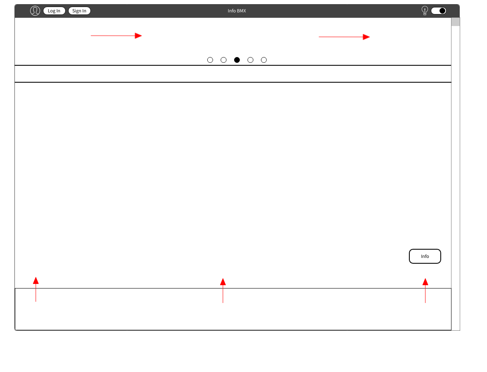
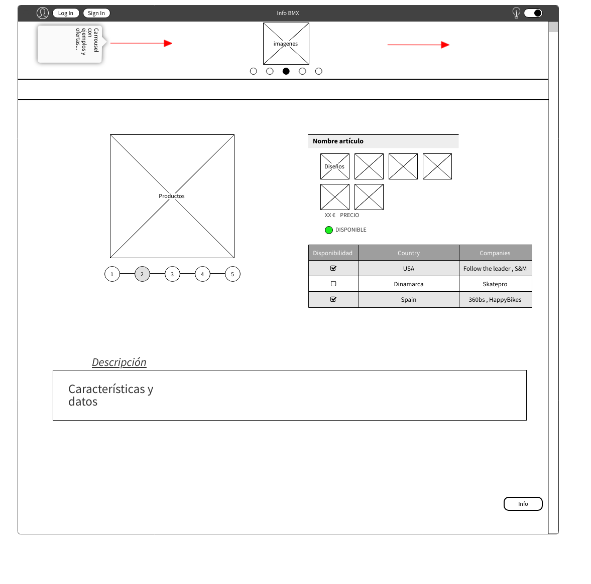
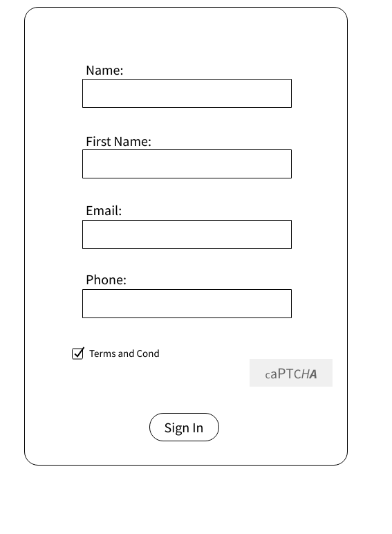
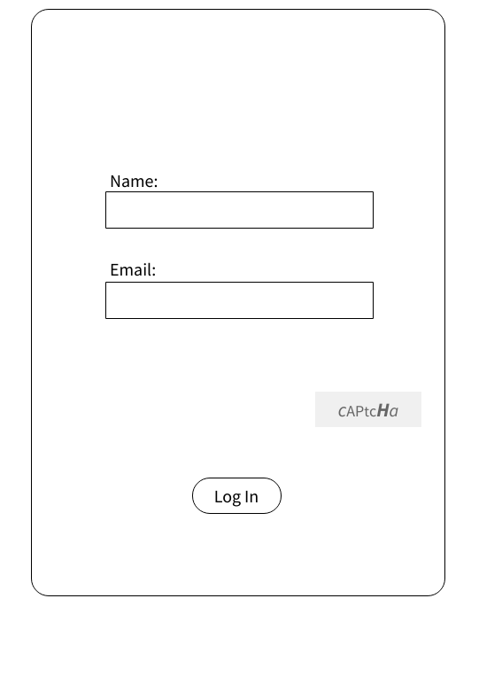
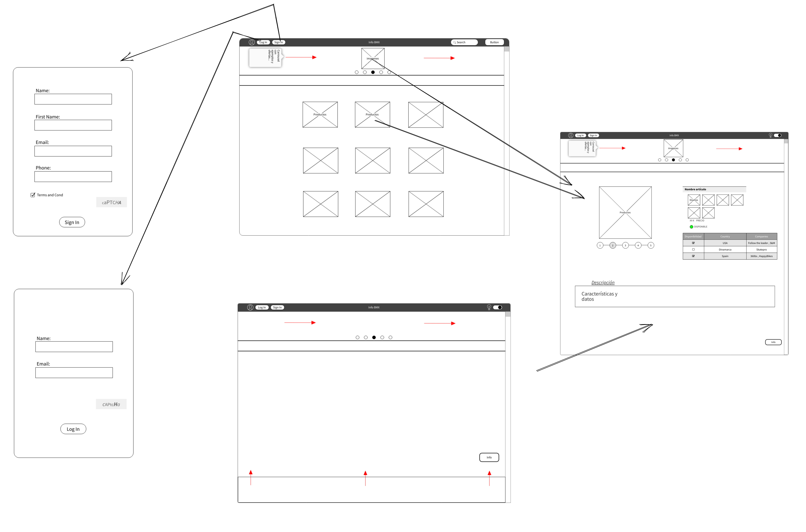

# Proyecto-final

Nombre del proyecto : **_Info BMX_**

## Explicación previa

Querría crear una página web para facilitar las busquedas de piezas de BMX, utilizando tanto HTML como CSS y JS. ¡Me gustaría implementar todo lo que he aprendido y más!

## Nombre del proyecto:

**_Info BMX_**

### Descripcion del proyecto:

Este proyecto será un FrontEnd dónde se pueda buscar piezas en concreto y su disponibilidad, así los usuarios tendrán más facilidad a la hora de encontrar piezas más concretas y en que lugar encontrarlas.

### Descripcion de las carcteristicas

Es una web que permite a todos los usuarios que quieran el poder encontrar piezas en concreto y su disponibilidad, incluyendo especificaciones, detalles, tallas, medidas, etc. Tiene como base poder hacer más fácil la busqueda de productos específicos.

## Documentacion técnica

### Base

Se crearan 5 html estáticas y estos tendran **cargas dinámicas de otros ficheros** para importar fragmentos como el menu y otras partes de la página...
Se utilizará CSS y o Boostrap para partes del diseño de la misma, incluso para una mejora en la usabilidad de la página.
También se utilizará JS para conseguir un diseño algo más vistoso y así conseguir un diseño más sencillo de comprender.

`También me gustaría añadir algo de BackEnd.` `()`

### Herramientas

Utilizaré GitHub para llevar el control de versiones, se utilizará la web "http://phpmyadmin.net" para tener una DB local en internet 24/7, también se utilizará Freenom para establecer un dominio fijo para la página.
Se utilizará composer para mantener las librerias actualizadas.

(Al final no he podido aplicar tanto tiempo en la base de datos como me hubiese)

### Lenguajes

HTML
CSS
JS
PHP
MySQL

## Diagrama de grantt

| Días/Lang | HTML | CSS | JS  | PHP | MySQL |
| --------- | ---- | --- | --- | --- | ----- |
| Día 1     | 5h   | 5h  | 0h  | 0h  | 0h    |
| Día 2     | 2h   | 4h  | 0h  | 0h  | 0h    |
| Día 3     | 5h   | 2h  | 0h  | 0h  | 0h    |
| Día 4     | 2h   | 0h  | 2h  | 0h  | 0h    |
| Día 5     | 0h   | 3h  | 2h  | 0h  | 0h    |
| Día 6     | 1h   | 2h  | 2h  | 0h  | 0h    |
| Día 7     | 2h   | 1h  | 1h  | 0h  | 0h    |
| Día 8     | 3h   | 2h  | 2h  | 0h  | 0h    |
| Día 9     | 0h   | 3h  | 2h  | 0h  | 0h    |
| Día 10    | 4h   | 2h  | 3h  | 2h  | 2h    |
| Día 11    | 2h   | 4h  | 1h  | 0h  | 0h    |
| Día 12    | 1h   | 2h  | 2h  | 0h  | 0h    |
| Día 13    | 1h   | 4h  | 1h  | 0h  | 0h    |
| Día 14    | 2h   | 1h  | 2h  | 0h  | 0h    |
| Día 15    | 2h   | 2h  | 2h  | 0h  | 0h    |
| Día 16    | 0h   | 0h  | 1h  | 4h  | 2h    |
| Día 17    | 3h   | 0h  | 2h  | 0h  | 0h    |
| Día 18    | 5h   | 2h  | 2h  | 1h  | 2h    |
| Día 19    | 3h   | 2h  | 1h  | 1h  | 2h    |

He cambiado mi anterior Diagrama de Grantt por este formato, el cúal se puede comprender y leer mucho mejor que la anterior version(la cuál también he modificado para que se pueda leer mucho mejor).

## Wireframes

#### Index

He conseguido hacerlo lo más parecido a la idea principal, exceptuando algunos detalles.

#### Menu

Al final no he necesitado un archivo de menu a parte, ya que todo lo que he necesitado lo he podido hacer sin este archivo.

#### Producto seleccionado

El diseño no es el mismo a la idea principal, pero el concepto de la misma ses el mismo, simplemente con un diseño distinto.

#### Sign In

No añadí la petición de un teléfono ya que no vi principalmente la necesidad de pedirlo.

#### Log In

## Paths

## Mokups

## Casos de uso

-Registra nuevos usuarios y vincula sus datos, de esta forma se puede mantener al día a todos los usuarios de ofertas o nuevos productos.

(No me ha dado tiempo a crear una base de datos para poder registrar a los usuarios de la misma. Pero si he podido crear una base de datos que guarda los productos que añade la gente para poder revisarlos después.)
