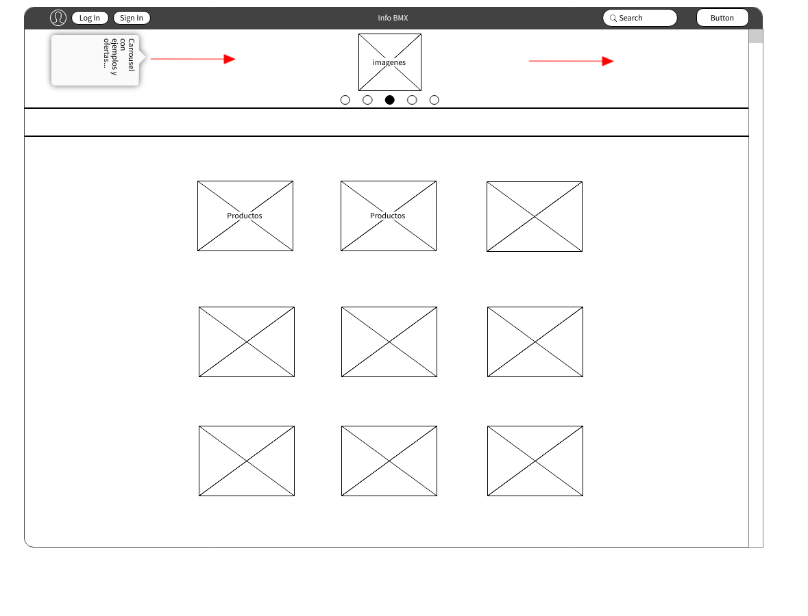
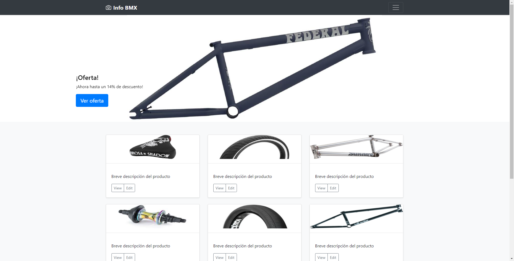

# Explicación

Tenía pensado hacer una página web dónde se pudiesen filtrar las busquedas y a la vez poder añadir productos y su ubicación (tanto en físico como en digital). Al final por falta de tiempo no he podido terminar todo lo que me gustaría hacer. Pero me esforzaré por seguir y terminar con este proyecto.

### Herramientas

Git hub, Herouka, Freenom y phpMyAdmin.

(Al final no he podido aplicar tanto tiempo en la base de datos como me hubiese gustado)

### Lenguajes

HTML
CSS
JS
PHP
MySQL

## Diagrama de grantt

| Días/Lang | HTML | CSS | JS  | PHP | MySQL |
| --------- | ---- | --- | --- | --- | ----- |
| Día 1     | 5h   | 5h  | 0h  | 0h  | 0h    |
| Día 2     | 2h   | 4h  | 0h  | 0h  | 0h    |
| Día 3     | 5h   | 2h  | 0h  | 0h  | 0h    |
| Día 4     | 2h   | 0h  | 2h  | 0h  | 0h    |
| Día 5     | 0h   | 3h  | 2h  | 0h  | 0h    |
| Día 6     | 1h   | 2h  | 2h  | 0h  | 0h    |
| Día 7     | 2h   | 1h  | 1h  | 0h  | 0h    |
| Día 8     | 3h   | 2h  | 2h  | 0h  | 0h    |
| Día 9     | 0h   | 3h  | 2h  | 0h  | 0h    |
| Día 10    | 4h   | 2h  | 3h  | 1h  | 0h    |
| Día 11    | 2h   | 4h  | 1h  | 0h  | 0h    |
| Día 12    | 1h   | 2h  | 2h  | 0h  | 0h    |
| Día 13    | 1h   | 4h  | 1h  | 0h  | 0h    |
| Día 14    | 2h   | 1h  | 2h  | 0h  | 0h    |
| Día 15    | 2h   | 2h  | 2h  | 0h  | 0h    |
| Día 16    | 0h   | 0h  | 1h  | 4h  | 2h    |
| Día 17    | 3h   | 0h  | 2h  | 0h  | 0h    |
| Día 18    | 5h   | 2h  | 2h  | 1h  | 2h    |
| Día 19    | 3h   | 2h  | 1h  | 1h  | 2h    |

He cambiado mi anterior Diagrama de Grantt por este formato, el cúal se puede comprender y leer mucho mejor que la anterior version(la cuál también he modificado para que se pueda leer mucho mejor).

## Wireframes

#### Index

He conseguido hacerlo lo más parecido a la idea principal, exceptuando algunos detalles.

#### Menu

Al final no he necesitado un archivo de menu a parte, ya que todo lo que he necesitado lo he podido hacer sin este archivo.

#### Producto seleccionado

El diseño no es el mismo a la idea principal, pero el concepto de la misma es el mismo, simplemente con un diseño distinto.

#### Sign In

No añadí la petición de un teléfono ya que no vi la necesidad de pedirlo.

#### Log In

## Paths

## Mokups

## Casos de uso

(No me ha dado tiempo a crear una base de datos para poder registrar a los usuarios de la misma. Pero si he podido crear una base de datos que guarda los productos que añade la gente para poder revisarlos después.)
